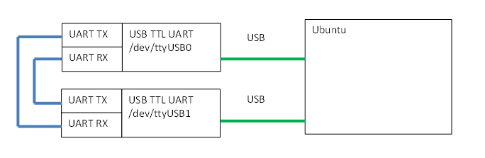
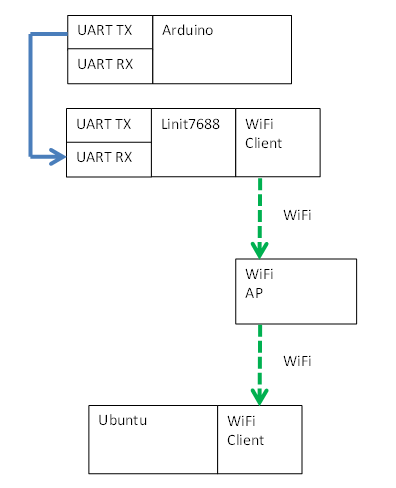

# uart_to_udp
Rx in uart message and Tx out UDP message

# Test#1 Local, UDP message Tx and Rx itself.
   
Run with X86 Ubuntu
bin_u86\udp.svr.out
bin_u86\udp.cli.out 127.0.0.1 

tpye something then press [Enter] with udp.cli.out.
udp.svr.out show the message.

# Test#2 minicom uart Tx and UDP Rx
   

# Test#3 arduino uart Tx, mt7688 uart Rx and UDP Tx, PC Rx UDP
   
