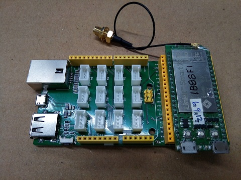
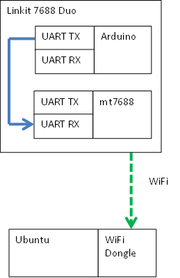
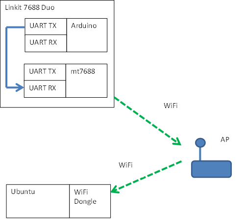
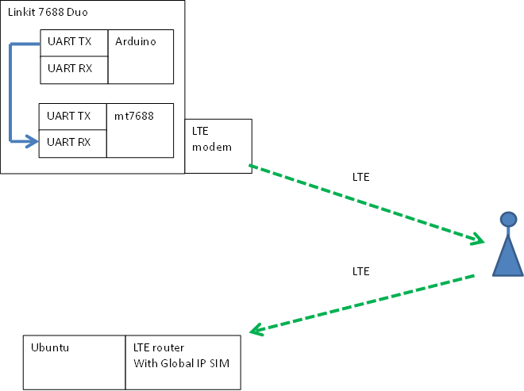
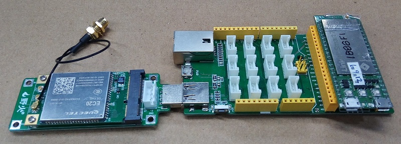

# uart_to_udp
Rx in uart message and Tx out UDP message

## Test#1 Local, UDP message Tx and Rx itself.
 
   
Run with X86 Ubuntu  
bin_u86\udp.svr.out  8888
bin_u86\udp.cli.out 127.0.0.1 8888
 
type something then press [Enter] with udp.cli.out  
udp.svr.out show the message.  
 

## Test#2 minicom uart Tx and UDP Rx
   
Run UDP server to Rx UDP message  
bin_u86\udp.svr.out  8888  
 
Run minicom with ttyUSB1, 115200, to Tx uart message from ttyUSB1.
 
Run bin_u18\uart2udp.out to Rx uart message from ttyUSB0, and send message out over UDP  
wait_usec=1001 is a magic number for showing more debug message.  
type something quickly with minicom.  
 
udp.svr.out show the message.  
   
 
## Test#3 arduino uart Tx, mt7688 uart Rx and UDP Tx, PC Rx UDP
Tested, this program is able to receive short string ( > 20 char) from arduino uart (115200) every 200ms.  
   
 
## Test#4 Log data with long distance
arduino uart Tx, mt7688 uart Rx and UDP Tx over WiFi, PC Rx UDP from WiFi.  
 
Method#1  
   
 
Method#1  
   

arduino uart Tx, mt7688 uart Rx and UDP Tx over LTE, PC Rx UDP from LTE.    
 
 

 
 
 
 
